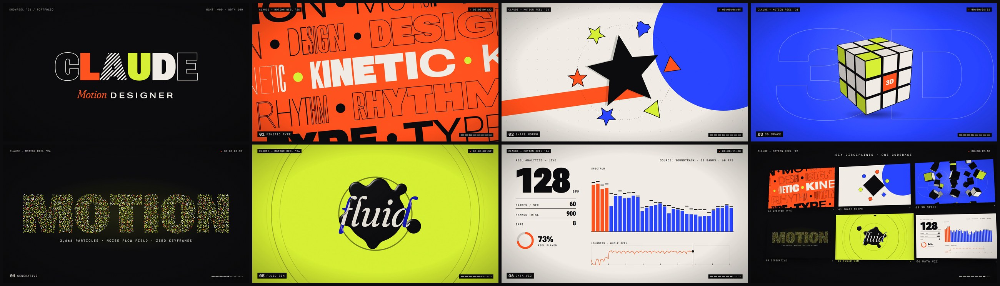

# CLAUDE — Motion Designer · Showreel 2026

A 15-second motion graphics showreel, built from scratch in code with
[Remotion](https://www.remotion.dev) 4.0.533 (React 19 + TypeScript). The soundtrack and
every sound effect are synthesised in Python. No stock footage, samples, templates or
After Effects were used.

**Watch:** [`deliverables/claude-showreel.mp4`](deliverables/claude-showreel.mp4).
It is 1920×1080 at 60 fps, H.264 + AAC, and exactly 15.000 s long.

[](deliverables/claude-showreel.mp4)

| Spec | Value |
| --- | --- |
| Length | 900 frames = 15.000 s = 8 bars at 128 BPM |
| Picture | 1920×1080, 60 fps, yuv420p BT.709, CRF 16, camera motion blur on the fast moves |
| Sound | 48 kHz stereo, −14 LUFS integrated, true peak below −1 dBTP |
| Type | Roboto Flex, Fraunces and Martian Mono (variable fonts, self-hosted, SIL OFL) |
| Palette | ink `#0C0C0E` · paper `#F1EEE6` · vermilion `#FF4423` · cobalt `#2E3BFF` · lime `#D8FF3C` |

## Run it

```bash
cd showreel
npm install
npm run dev          # Remotion Studio → http://localhost:3000, pick "ClaudeShowreel"
```

Studio also has a **Scenes** folder that lists every section as its own composition,
so you can scrub one part at a time.

| Task | Command |
| --- | --- |
| Preview in Studio | `npm run dev` |
| Render the MP4 (Remotion's own mux) | `npm run render` → `out/claude-showreel.mp4` |
| Render + exact-length delivery file | `npm run deliver` → `deliverables/claude-showreel.mp4` (needs `ffmpeg`) |
| Regenerate music, SFX and spectrum data | `npm run audio` (Python 3 with `numpy scipy pyloudnorm`) |
| Re-download the fonts | `npm run fonts` |
| Rebuild particle targets and grain | `npm run assets` (Python 3 with `fonttools brotli pillow scipy`) |
| Lint + typecheck | `npm run lint` |
| One still for a quick check | `npx remotion still ClaudeShowreel out/check.png --frame=510` |

On an offline or firewalled machine, Remotion can't download its headless Chrome. Point
it at one you already have with
`REMOTION_BROWSER_EXECUTABLE=/path/to/chrome-headless-shell npm run deliver`.

## The cut

Every section starts on the beat. Cuts fall in a 3 + 3 + 2 (tresillo) pattern, so the
montage pushes against the four-to-the-floor kick.

| # | Time (s) | Beats | Section | What it shows off |
| --- | --- | --- | --- | --- |
| — | 0.00–1.88 | 0–4 | **Leader** | A film-leader countdown rebuilt as motion design. The dot becomes a line, the line becomes crosshairs, rings and a tick dial. Each numeral morphs from black/extended to hairline/condensed across its beat. Then everything implodes. |
| — | 1.88–3.75 | 4–8 | **Name slam** | CLAUDE slams in letter by letter with squash and blur. It flexes through the variable-font design space (live `wght`/`wdth` readout). It cycles fill styles on 8th notes, then explodes with an RGB-split glitch. |
| 01 | 3.75–5.16 | 8–11 | **Kinetic type** | Counter-scrolling rows of outline, solid and dotted type. Every letter rides its own sine through the weight and width axes. The block pumps on the beat. |
| 02 | 5.16–6.56 | 11–14 | **Shape morph** | Circle → square → triangle → star → hexagon → plus → square. Each shape is resampled to 120 radial points, so any shape morphs cleanly into any other. Satellites run the same morphs out of phase. |
| 03 | 6.56–7.50 | 14–16 | **3D space** | A 27-cubie cube in pure CSS 3D swings in and explodes on the beat. |
| 04 | 7.50–8.91 | 16–19 | **Generative** | 3,666 canvas particles burst and swirl through a noise flow field. They assemble into "MOTION", sampled from the real Roboto Flex glyphs, then blow out toward the camera. Every position is a pure function of the frame. |
| 05 | 8.91–10.31 | 19–22 | **Fluid sim** | SVG metaballs (blur + alpha threshold) with a specular lighting pass. The masses collide and eject droplets on every "bloop", ripples run across the surface, and the goo floods the frame. |
| 06 | 10.31–11.25 | 22–24 | **Data viz** | Real data. The 32-band analyser, peak caps and loudness curve are computed from this reel's own soundtrack and read at the true frame. |
| — | 11.25–13.13 | 24–28 | **Range wall** | A match cut out of the Data Viz tile pulls back to all six vignettes, still playing. Each is time-remapped through `<Freeze>`. The wall tilts in 3D, the tiles flash on the snare roll, and the camera dives through. |
| — | 13.13–15.00 | 28–32 | **End card** | A three-arc monogram draws on while a lime dot spirals in and lands on the chime. The name resolves through the type axes, then role and skills follow on the beat. The glow breathes with the final chord. |

## How it stays in sync

`src/timeline.json` is the single source of truth for both picture and sound. It holds
the BPM, the sections (in beats), the cuts and a cue sheet of about 50 sound events.

- **Video**
  - `src/lib/time.ts` converts beats to frames with `bf(beat) = round(beat × 28.125)`.
  - Every scene renders inside a `<Sequence>`. Each one calls `useBeatClock(section)`,
    whose `at(localBeat)` gives the frame of any beat on the global grid.
- **Audio**
  - `audio/generate_audio.py` reads the same file. It places every cue on the same grid,
    then builds the arrangement around the sections: an intro riser, the drop on beat 4,
    a sidechained groove through the montage, a snare-roll build, a 1/16 of silence and
    the final impact.
  - It then masters the mix and writes `public/audio/soundtrack.wav`.
  - It also analyses the master into `src/data/spectrum.json` (32 bands plus momentary
    loudness per video frame), which feeds the Data Viz scene and the end card.
- **Remapped tiles**
  - Scenes that are time-remapped in the wall still read the real reel frame through a
    small `GlobalFrame` context, so audio-reactive parts never drift.

Change the BPM or move a cue in `timeline.json`, run `npm run audio`, and picture, sound
and analysis all follow.

## Project layout

```
showreel/
  src/
    Root.tsx              ClaudeShowreel + one composition per scene (Scenes folder)
    Reel.tsx              assembly: sequences, camera shake, HUD, cut flashes, grain, audio
    timeline.json         beat grid, sections, cuts, cue sheet (shared with the audio script)
    theme.ts              palette, self-hosted variable fonts, axes() helper
    lib/                  time.ts (beat clock), ease.ts (curves, tweens), morph.ts (radial shape sampling)
    components/           Hud, FX (shake + cut flashes), MotionBlur, Grain, GlobalFrame
    scenes/               Leader, NameSlam, KineticType, ShapeMorph, Cube3D, Particles,
                          Fluid, DataViz, GridWall, EndCard
    data/                 particles.json (glyph-sampled targets), spectrum.json (from the audio)
  audio/generate_audio.py music + SFX synthesis, mastering, spectrum analysis
  scripts/                fetch_fonts.py, prepare_assets.py, deliver.sh
  public/                 fonts/ (woff2 + OFL licences), textures/grain.png, audio/soundtrack.wav
  deliverables/           the finished MP4 + contact sheet
```

## Rules the code follows

- Everything is a pure function of the frame. There are no CSS transitions or timers,
  and every random value is seeded (`random("seed")`, `noise2D`). Any frame renders
  identically, in any order, on any machine.
- Times are authored in beats and converted once. Changing `fps` or `bpm` in
  `timeline.json` reflows the whole reel.
- Frames are PNG and encoded as yuv420p H.264 with BT.709 tags, so the flat colour
  fields stay clean.

## Credits and licences

- Code, design, music and sound design: original, made for this reel.
- Fonts: [Roboto Flex](https://github.com/googlefonts/roboto-flex),
  [Fraunces](https://github.com/undercasetype/Fraunces) and
  [Martian Mono](https://github.com/evilmartians/mono), all under the SIL Open Font
  License (copies in `public/fonts/`).
- Remotion is free for individuals and small teams. Larger companies need a
  [company license](https://www.remotion.dev/docs/license).
